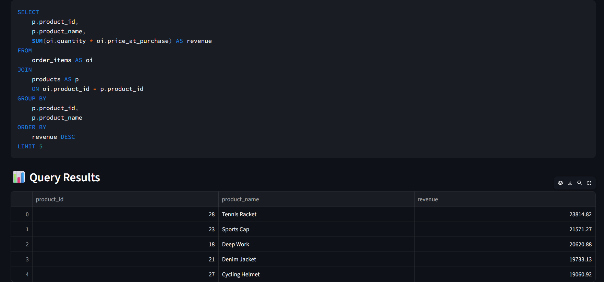
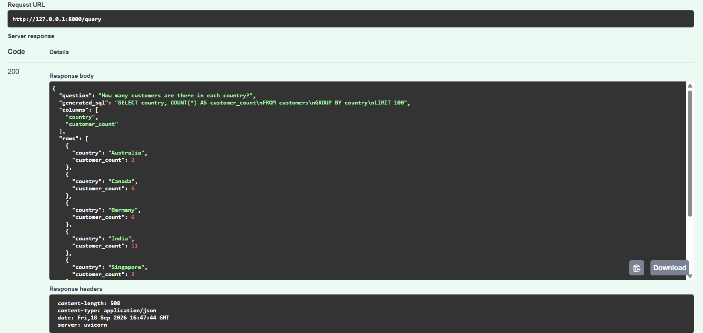
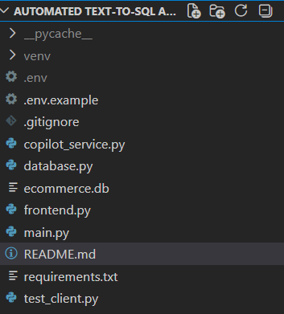

# 🤖 Automated Text-to-SQL Analytics Copilot

An AI-powered analytics application that allows users to query an e-commerce database using natural language.

Instead of writing SQL manually, users can ask questions such as:

> "What are the top 5 products by revenue?"

The application uses an LLM to convert the natural-language question into SQL, validates the generated SQL using safety guardrails, executes it against a SQLite database, and displays the results through an interactive Streamlit interface.

---

## 📸 Screenshots

### 📊 Analytics Dashboard



### 🔌 FastAPI Swagger API



### 💻 Project Structure



---

## 🚀 Features

- 💬 Natural-language database queries
- 🤖 AI-powered Text-to-SQL generation
- 🔍 Automatic database schema introspection
- 🔐 SQL safety validation
- 🗄️ SQLite database integration
- ⚡ FastAPI backend
- 🎨 Streamlit frontend
- 📊 Interactive query result tables
- 📈 Automatic data visualization
- 🧠 Displays generated SQL
- ❌ Error handling
- 🔢 Query statistics
- ⏱️ Query performance measurement

---

## 🏗️ Architecture

```text
                         USER
                           │
                           ▼
                 ┌──────────────────┐
                 │ Streamlit        │
                 │ Frontend         │
                 └────────┬─────────┘
                          │
                     HTTP Request
                          │
                          ▼
                 ┌──────────────────┐
                 │ FastAPI Backend  │
                 └────────┬─────────┘
                          │
                ┌─────────┴─────────┐
                │                   │
                ▼                   ▼
        Database Schema       User Question
        Introspection                │
                │                    │
                └─────────┬──────────┘
                          ▼
                 ┌──────────────────┐
                 │     Groq LLM     │
                 │    Text → SQL    │
                 └────────┬─────────┘
                          │
                    Generated SQL
                          │
                          ▼
                 ┌──────────────────┐
                 │  SQL Validator   │
                 │   Read-Only      │
                 └────────┬─────────┘
                          │
                    Validated SQL
                          │
                          ▼
                 ┌──────────────────┐
                 │ SQLite Database  │
                 └────────┬─────────┘
                          │
                       Results
                          │
                          ▼
                 ┌──────────────────┐
                 │ Results + Charts │
                 │    Streamlit     │
                 └──────────────────┘